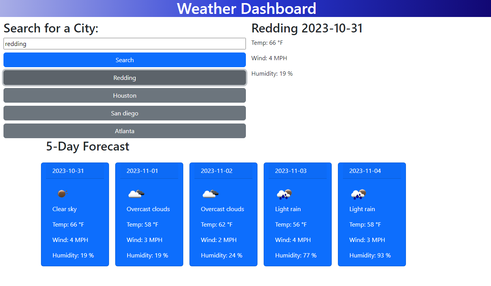

# 5 Day Weather Forecast Dashboard

The 5 Day Weather Forecast Dashboard is a user-friendly website that will provide users with the weather forecast for the next five days in any city they search. This application uses the OpenWeather API to fetch accurate weather data and is styled using Bootstrap.

## Table of Contents

- [Technologies Used](#technologies-used)
- [Features](#features)
- [Functionality](#functionality)
- [Screenshots](#screenshots)
- [Website Link](#website-link)

## Technologies Used

- HTML
- CSS
- JavaScript
- Bootstrap
- OpenWeather API
- LocalStorage

## Features

- **City Search**: Users can search for any city worldwide to view its weather forecast.
- **5 Day Forecast**: Displays weather predictions for the next five days with details such as temperature, wind speed, and humidity.
- **Search History**: Saves the search history for cities in buttons the user can click to see previous searches.
- **Responsive Design**: The website is fully responsive and can adapt to various screen sizes, from desktops to mobile devices.

## Functionality

The main functionality of the 5 Day Weather Forecast Dashboard is achieved through JavaScript. When a user inputs a city name and submits the form, a series of fetch requests are initiated:

1. **Geocoding API Request**: The city name is converted to geographic coordinates (lat and lon) using the OpenWeather Geocoding API.
2. **Weather API Request**: With the obtained coordinates, the OpenWeather API is called to fetch the 5-day weather forecast data.
3. **DOM Manipulation**: The fetched data is dynamically displayed on the webpage, updating the weather forecast and current weather information sections.
4. **LocalStorage**: User searches are saved to LocalStorage, allowing for persistent history between sessions.

## Screenshots

## Website Link

[5 Day Weather Forecast Dashboard](https://empireantz.github.io/weather-forecast/)

## Credits 

✨ Developed by yours truly ✨
